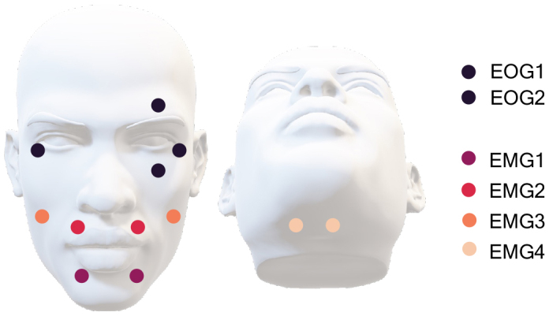

# FacialGestures — run sheet

Facial-gesture task (Tuomaala et al., 2025), run in the MEG **before** the naming
task. It records clean facial-muscle artefacts with simultaneous EMG, which are then
used to remove speech artefacts from the MEG data automatically. Full paradigm
details, trigger codes, outputs and deviations are in
[`description.md`](description.md).

**Duration:** one run, **7 min 38 s** of recording by default (shortened: 3 sets, see below),
plus the instruction screens. The paper's full version (5 sets, 13 min 50 s) is
`--sets 5 --later-instr-ms 5000`.

> Tuomaala, S., Autti, S., Cotroneo, S.F., Lioumis, P., Renvall, H., Liljeström, M.
> (2025). *Automated speech artefact removal from MEG data utilizing facial gestures
> and mutual information.* Imaging Neuroscience, 3, imag_a_00545.
> [doi:10.1162/imag_a_00545](https://doi.org/10.1162/imag_a_00545) ·
> open access: [PMC12319751](https://pmc.ncbi.nlm.nih.gov/articles/PMC12319751/)

## Artefact-removal pipeline (analysis)

The analysis code from the paper is at
**https://github.com/BioMag/speech_artefact_removal** (Python 3.10, MNE-Python 1.3).
It covers these steps:

1. **Pre-processing**: tSSS (external noise, head movements), then FastICA to remove
   eye blinks and heartbeats (EOG/ECG).
2. **ICA on the pre-processed data** (FastICA, ~68 components):
   `artefact_removal/fit_and_save_ICA.py`.
3. **Mutual information** between the PCA-decomposed EMG signals and each ICA
   component (k-nearest-neighbour estimator, k = 3).
4. **k-means clustering** (k = 5) of the components by MI. The highest-MI cluster is
   removed: `artefact_removal/MIC-ICA.py`. **MIC-ICA-GN** (named MIC-ICA-G in the
   paper's Fig. 1) also uses the data from this gesture task; MIC-ICA-N uses the
   naming data only.
5. Evaluation plots (sensor/source statistics, RMSD topographies): `evaluation_plots/`.

This experiment produces the gesture-paradigm input used by **MIC-ICA-GN**. In the
paper, all three methods (Manual-ICA, MIC-ICA-N, MIC-ICA-GN) performed similarly at
group level. MIC-ICA-GN was more robust: it affected speech-production areas least,
treated both hemispheres more symmetrically, and was less sensitive to the number of
clusters k.

**About the shortened default (3 sets).** The pipeline runs the same way with 15
repetitions per gesture instead of 25: the gesture data are simply concatenated with
the naming data before ICA and MI. However, the paper did **not** test shorter
gesture recordings. The authors write that "future studies could address the optimal
EMG placement and gesture task duration and structure". So with less gesture data,
part of MIC-ICA-GN's robustness advantage may be lost, and MIC-ICA-N (no gesture data
at all) remains a fallback. If session time allows, the paper's version is
`--sets 5 --later-instr-ms 5000`.

## 1. Build

```bash
cd examples/FacialGestures
go build .                                    # → ./FacialGestures
# cross-compile for the MEG stim PC:
CGO_ENABLED=0 GOOS=linux GOARCH=amd64 go build -o FacialGestures-linux-amd64 .
```

No asset file is needed: the beep and the gesture schematics are generated at startup.

## 2. Flags

| Flag | Default | Meaning |
|---|---|---|
| `-s` | 0 | subject ID |
| `--sets` | 3 | number of sets (paper: 5; use 1 for a quick 2 min 47 s test) |
| `--later-instr-ms` | 3000 | gesture-instruction duration from set 2 on (paper: 5000; set 1 always 5000) |
| `--trigger` | `parport` | `parport` or `none` |
| `--parport` | `/dev/parport1` | trigger output port |
| `--pulse-ms` | 5 | TTL pulse width |
| `--data-dir` | `data/` next to the experiment | output folder |
| `--seed` | 0 (clock) | gesture-order seed (logged, for reproducibility) |
| `-w` / `-d N` | fullscreen / primary | windowed mode / display index |

Test outside the MEG room:

```bash
go run . -w -s 1 --sets 1 --trigger none
```

## 3. EMG / EOG / ECG montage (Tuomaala et al., 2025, Fig. 4)



*Placements of the EOG and EMG sensors. EOG1 and EOG2 represent the placements of
the electrooculogram sensors that measured the horizontal and vertical eye movements.
The facial muscle activity was measured with sensors EMG1–EMG4.* Reproduced from
Tuomaala et al. (2025), Imaging Neuroscience, under
[CC BY 4.0](https://creativecommons.org/licenses/by/4.0/).

**EOG**, 2 pairs:
- horizontal: outer canthi of both eyes
- vertical: above and below one eye

**EMG**, 4 bipolar pairs of surface electrodes:

| Pair | Muscle (paper text) | Position in the figure |
|---|---|---|
| EMG1 / EMG2 | orbicularis oris **superioris** / **inferioris** (as in Abbasi et al., 2021) | one pair above the upper lip (on each side of the philtrum), one pair below the lower lip |
| EMG3 | zygomaticus | cheeks, lateral to the nose, one electrode on each side |
| EMG4 | submental (tongue activity) | under the chin, either side of the midline |

The paper says EMG3 and EMG4 capture activity close to the rim of the MEG helmet and
activity from the tongue. **Note:** in the published figure, the legend colours put
EMG1 below the lower lip and EMG2 above the upper lip, the reverse of the paper's
text. Label the channels by position in your acquisition setup.

Also record **ECG** (used with EOG for blink/heartbeat ICA).

## 4. Before starting: checklist

- [ ] EMG/EOG/ECG electrodes placed as above, impedances OK, signals visible on the acquisition screen.
- [ ] **Audio:** beep clearly audible to the participant at a comfortable level. Pin
      the output sink if needed, e.g. `SDL_AUDIODRIVER=pulseaudio PULSE_SINK=<sink> ./FacialGestures …`
      (see `MindSentencesExtension/run_meg.sh`).
- [ ] **Audio lag:** the beep (microphone/sensor) is recorded on a MISC channel, or the
      trigger→sound lag has been measured for this setup. It must be subtracted at
      analysis. Do **not** assume the ~100 ms reported on the test bench.
- [ ] **Triggers:** the first experimenter screen must say
      `Triggers: parallel port /dev/parport1 — READY`. If it says **DISABLED**, stop and
      check the port (`sudo modprobe ppdev`, group `lp`, `tools/parport-diag`).
- [ ] Projector: the fixation cross and the schematics are visible to the participant.
- [ ] **MEG acquisition running** before you press SPACE on the participant instruction screen.
- [ ] Correct subject ID (`-s`).

## 5. Procedure

1. **Before entering the MSR:** go through the 10 gestures with the participant
   (the schematics on screen are the same as during the task). Stress: **one**
   gesture per beep, a short contraction, then **full relaxation**. Keep the head
   still, eyes on the cross, no speech.
2. Start the program → **experimenter screen** (subject, duration, trigger status) → SPACE.
3. **Participant instruction screen** → start the MEG acquisition → SPACE. This
   sends trigger **100**, and the timed task begins 1 s later.
4. The task needs no intervention (7 min 38 s with the defaults). For each set: set screen (trigger
   21–23; 21–25 with `--sets 5`), then 10 gestures, each with an instruction + schematic screen (trigger
   11–20) and 5 beeps (trigger 1–10).
5. Trigger **101** at the end, then a "Finished, thank you!" screen → SPACE to quit.

**Escape** aborts at any time. Data already written is kept, and the `.tsv` gets a
`RUN_ABORTED` row. If you relaunch, the new files get a new timestamp, so nothing is
overwritten.

## 6. Outputs

Files go in the **`data/` folder of the experiment** (`examples/FacialGestures/data/`,
or `data/` next to the binary when it is copied elsewhere; override with
`--data-dir`). The folder is created automatically and is git-ignored. Each session
produces three files with the same base name:

- `FacialGestures_sub-XXX_date-YYYYMMDD-HHMM_events.tsv`: **all events and
  triggers** (BIDS-style `onset`, `duration`, `trial_type`, `value` = trigger code,
  plus set/gesture/muscle/repetition, nominal vs. real onset, realised period, flip
  and trigger timestamps). Use it to align the MEG triggers with the stimuli.
- `FacialGestures_sub-XXX_date-YYYYMMDD-HHMM.csv`: one row per repetition, gesture
  block and set.
- `FacialGestures_sub-XXX_date-YYYYMMDD-HHMM-info.txt`: system/display metadata,
  seed, trigger settings.

After the session, quickly check in the `.tsv` that there are 150 `REPETITION`
rows (250 with `--sets 5`), `period_ms` ≈ 2000, and small `onset_error_ms` values (within about ±1 frame).
